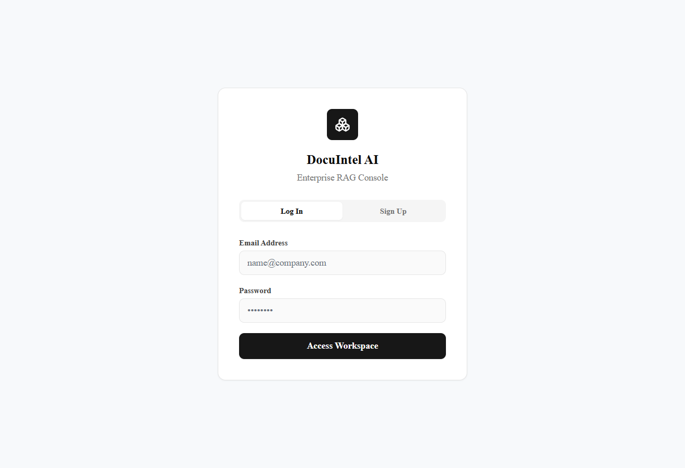
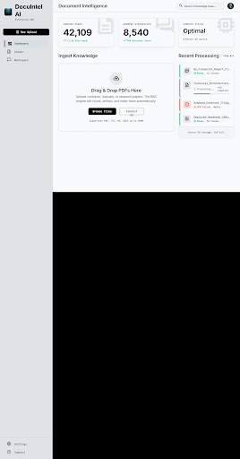
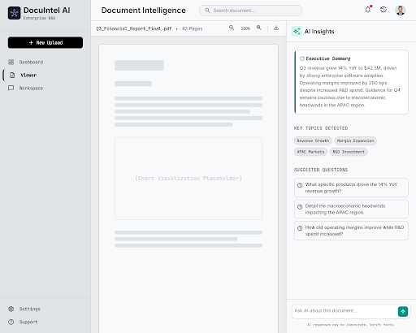
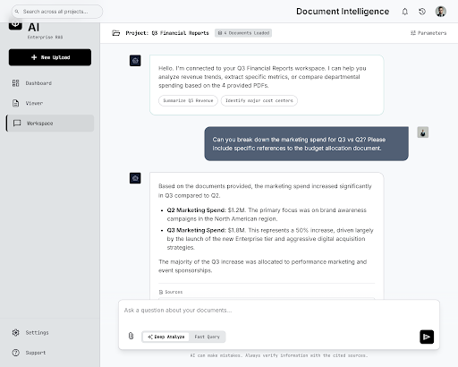
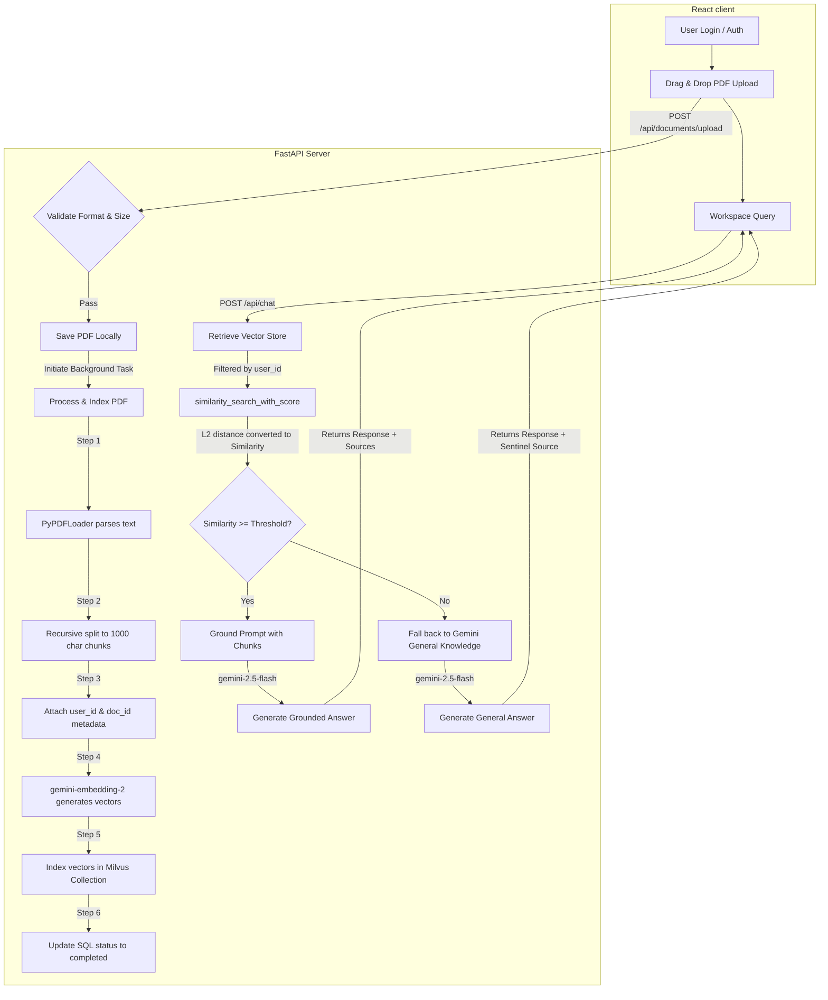
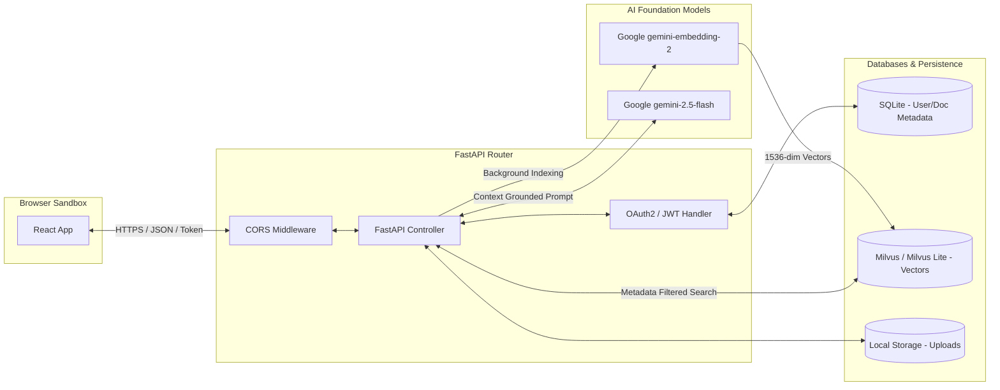

# 🤖 DocuIntel AI: Enterprise RAG Console

*A highly-scalable, production-ready Retrieval-Augmented Generation (RAG) platform that provides context-grounded, hallucination-free AI answers from your enterprise PDF documents.*

<div align="center">

[](https://www.python.org/)
[](https://fastapi.tiangolo.com/)
[](https://www.langchain.com/)
[](https://ai.google.dev/)
[](https://milvus.io/)
[](https://www.docker.com/)
[](https://opensource.org/licenses/MIT)

</div>

---

## 📌 Table of Contents

- [Project Overview](#project-overview)
- [Features](#features)
- [Screenshots Walkthrough](#screenshots-walkthrough)
- [Project Workflow](#project-workflow)
- [Architecture Diagram](#architecture-diagram)
- [Folder Structure](#folder-structure)
- [Tech Stack](#tech-stack)
- [Installation & Setup](#installation--setup)
- [Environment Variables](#environment-variables)
- [Usage Guide](#usage-guide)
- [AI Pipeline Details](#ai-pipeline-details)
- [API Documentation](#api-documentation)
- [Configuration Settings](#configuration-settings)
- [Performance Optimizations](#performance-optimizations)
- [Error Handling](#error-handling)
- [Security Audit](#security-audit)
- [Future Improvements](#future-improvements)
- [Contributing](#contributing)
- [License](#license)
- [Author](#author)

---

## 📖 Project Overview

**DocuIntel AI** is a state-of-the-art Enterprise Retrieval-Augmented Generation (RAG) platform designed to eliminate LLM hallucinations by grounding responses directly in your organization's proprietary PDF documents. 

In today's corporate landscape, critical knowledge is locked away in sprawling PDFs, reports, and manuals. Traditional keyword search is insufficient, and public LLMs lack access to these private docs while risking data exposure. **DocuIntel AI** solves this by providing:
1. **Secure Document Ingestion**: Users register, log in, and upload private PDFs.
2. **Deterministic Retrieval**: Document text is chunked, mapped into vector embeddings, and indexed in Milvus.
3. **Contextual Grounding**: User queries fetch the most semantically similar text segments.
4. **Smart LLM Generation**: Google Gemini 2.5 Flash constructs responses *exclusively* from retrieved segments, falling back gracefully to general knowledge only when allowed by safety thresholds.

By hosting the vector index and document storage in isolated user domains, DocuIntel AI ensures enterprise-grade security and document privacy.

---

## ⚡ Features

### 🧠 AI & Retrieval Features
- **Retrieval-Augmented Generation (RAG)**: Generates precise answers anchored in uploaded PDF context.
- **Semantic Vector Search**: Powered by `gemini-embedding-2` for multi-dimensional semantic mapping.
- **Hybrid Fallback Logic**: If no document chunks meet the similarity threshold, the system gracefully falls back to Gemini's general knowledge while explicitly marking the output source as `__gemini_general__`.
- **Source Attribution**: Returns exact document names and similarity scores for every answer chunk.
- **Dynamic Retrieval Tuning**: Slide-to-adjust control for `Top-K Chunks` and `Similarity Threshold` at query time.

### ⚙️ Backend Features
- **FastAPI Core**: High-performance, asynchronous REST APIs with auto-generated OpenAPI documentation.
- **User Document Isolation**: Multi-tenancy support using SQLAlchemy-managed user accounts and metadata-filtered vector queries.
- **Background Ingestion Tasks**: FastAPI `BackgroundTasks` processes heavy PDF parsing and vector indexing asynchronously without blocking the UI.
- **SQLite Database Integration**: SQL storage for user credentials and document ingestion audit trails.

### 🎨 Frontend Features
- **Premium Glassmorphic Design**: Clean UI with dynamic micro-animations and status trackers.
- **Interactive Workspace Chat**: Context-grounded conversation terminal showing live source references.
- **Drag-and-Drop Uploader**: Modern drag-and-drop zone supporting PDF files up to 50MB.
- **Pipeline Ingestion Tracker**: Live progress check showing stages: Ingestion ➔ Chunking ➔ Embeddings ➔ Vector DB Indexing.

---

## 📸 Screenshots Walkthrough

### 1. User Authentication

* **Functional Description**: Secure gateway supporting email/password registration and JWT-based session token acquisition. It includes a user-friendly error banner to notify users of network issues or invalid credentials.

---

### 2. Document Dashboard & Pipeline Ingestion Tracker

* **Functional Description**: The administration hub where users upload files. Once a file is dropped, the backend initiates a multi-stage background worker. The status card shows progress on document ingestion, text chunking, embedding generation, and vector store indexing. It also displays ingestion stats like total chunks created and embedded.

---

### 3. Document Metadata Viewer

* **Functional Description**: Provides a checklist of uploaded documents, showing file name, size, upload time, and backend verification markers. Users can review their active knowledge base footprint or delete files to remove their indices from the database.

---

### 4. Workspace Chat Interface

* **Functional Description**: The query terminal. Users adjust the parameters (Top-K Chunks, Similarity Threshold) on the left sidebar to fine-tune retrieval constraints. When a query is submitted, the conversation rendering shows both the text response and fallback warnings (e.g., indicating if no sources matched the threshold).

---

## 🛠️ Project Workflow



---

## 🏗️ Architecture Diagram



---

## 🗂️ Folder Structure

```text
docuintel-ai/
├── backend/                       # FastAPI Python Backend
│   ├── __init__.py                # Package initialization
│   ├── auth.py                    # JWT, Bcrypt hashing, & Dependency injection
│   ├── database.py                # SQLAlchemy engine and session pool
│   ├── models.py                  # Database entities (User, Document)
│   ├── schemas.py                 # Pydantic schemas (Req/Res validation)
│   ├── main.py                    # Main FastAPI controller & static mounts
│   └── rag_service.py             # Vector search, PDF parsing, & Gemini RAG
├── frontend/                      # React / Vite SPA Frontend
│   ├── dist/                      # Production build assets (created on build)
│   ├── src/                       # Frontend Source code
│   │   ├── components/            # Reusable UI widgets
│   │   ├── App.jsx                # Core application workflow state and views
│   │   ├── index.css              # Custom Tailwind/Vanilla layout styles
│   │   └── main.jsx               # React DOM entry mount
│   ├── package.json               # Node dependency config
│   └── vite.config.js             # Vite development proxy options
├── screenshots/                   # Application walk-through images
├── docker-compose.yml             # Orchestration for etcd, minio, milvus, & app
├── Dockerfile                     # Multi-stage production build script
├── requirements.txt               # Backend Python dependencies
├── start.bat                      # Local automation script for Windows
├── .env.example                   # Template for environment settings
└── README.md                      # Documentation (This file)
```

---

## 💻 Tech Stack

| Category | Technology | Purpose |
| :--- | :--- | :--- |
| **Frontend Framework** | React 19 + Vite | High-performance Single Page Application framework |
| **Styling** | Vanilla CSS + Tailwind | Fluid, glassmorphic layout system with dark modes |
| **API Framework** | FastAPI (Python 3.12) | Asynchronous backend endpoints for upload & querying |
| **Database (Relational)** | SQLite + SQLAlchemy | Persistence of user credentials & ingestion metadata |
| **Vector Database** | Milvus Standalone (v3.0) / Milvus Lite | Semantic embedding indexing and high-speed vector retrieval |
| **Embeddings Model** | Google gemini-embedding-2 | Generating high-dimensional vector representations |
| **Language Model (LLM)** | Google gemini-2.5-flash | Fast, highly accurate context-grounded response generation |
| **RAG Orchestration** | LangChain (Community & Core) | Handles document loading, splitting, and vector store bindings |
| **PDF Parser** | PyPDF (via PyPDFLoader) | Extracting text layers from raw files |
| **Authentication** | PyJWT + Bcrypt | Secure token generation, verification, and password hashing |
| **Containerization** | Docker + Docker Compose | Standardization of etcd, MinIO, Milvus, and the app |

---

## 🚀 Installation & Setup

### Option 1: Quick Start via Docker Compose (Recommended)
This launches the full production-grade stack including the isolated Milvus server, MinIO object store, etcd config manager, and your application.

1. **Clone the Repository**:
   ```bash
   git clone https://github.com/your-username/docuintel-ai.git
   cd docuintel-ai
   ```

2. **Configure Environment Variables**:
   Create a `.env` file in the root directory:
   ```env
   GOOGLE_API_KEY="AIzaSyYourGeminiApiKeyHere"
   JWT_SECRET="generate-a-secure-random-string-for-sessions"
   ```

3. **Start the Multi-Container Stack**:
   ```bash
   docker compose up --build
   ```
   *The backend will automatically start database tables, and the application will be accessible at `http://localhost:8000` (or `http://localhost:5173` during local dev).*

---

### Option 2: Local Development Mode (Run local server and dev client)
For developers working without Docker, the application uses **Milvus Lite** locally, which stores vectors in a lightweight local DB file.

#### Backend Setup:
1. **Navigate to root and create a virtual environment**:
   ```bash
   python -m venv .venv
   .venv\Scripts\activate      # Windows
   source .venv/bin/activate    # macOS/Linux
   ```

2. **Install Python Packages**:
   ```bash
   pip install -r requirements.txt
   ```

3. **Set Environment Variables in Root `.env`**:
   ```env
   GOOGLE_API_KEY="AIzaSyYourGeminiApiKeyHere"
   JWT_SECRET="your-development-jwt-secret-key"
   MILVUS_HOST="localhost"
   ```

4. **Launch FastAPI Backend**:
   ```bash
   # Set PYTHONPATH to include the backend folder
   set PYTHONPATH=backend
   python -m uvicorn backend.main:app --reload --host 127.0.0.1 --port 8000
   ```

#### Frontend Setup:
1. **Navigate to the frontend folder**:
   ```bash
   cd frontend
   npm install
   ```

2. **Launch Dev Client**:
   ```bash
   npm run dev
   ```
   *Open your browser to `http://localhost:5173/`.*

---

## 🔑 Environment Variables

| Variable | Scope | Purpose | Required | Example |
| :--- | :--- | :--- | :--- | :--- |
| `GOOGLE_API_KEY` | Backend | Connects to Gemini LLM & Embedding services | **Yes** | `AIzaSyA88_...` |
| `JWT_SECRET` | Backend | Secret key used to sign session cookies/tokens | **Yes** | `d4e5f6g7h8...` |
| `MILVUS_HOST` | Backend | Targets Milvus Host (use `localhost` for local/lite) | No | `milvus-standalone` |
| `DATABASE_URL` | Backend | Database connection URL for user management | No | `sqlite:///./backend.db` |
| `JWT_EXPIRE_MINUTES` | Backend | Expiration duration for session access tokens | No | `1440` (24 hours) |

---

## 📘 Usage Guide

1. **Create an Account**: Open the platform, click **Sign Up**, and register with your email and password.
2. **Access Workspace**: Log in with your registered credentials.
3. **Upload PDF**: On the **Dashboard**, drop any PDF file. The pipeline tracker will update you on the ingestion phases (Parsing ➔ Chunking ➔ Embedding ➔ Vector DB Indexing).
4. **View Documents**: Navigate to the **Documents Viewer** to confirm that the file metadata is correctly parsed and marked as `Completed`.
5. **Chat with Documents**: Head to **Workspace Chat**, type in questions, and click send. Review the returned text alongside the source files used to construct the answer.

---

## 🤖 AI Pipeline Details

```
                                      Ingestion Pipeline
┌──────────────┐      ┌─────────────┐      ┌─────────────────┐      ┌─────────────┐      ┌─────────────┐
│ Uploaded PDF │ ───> │ PyPDFLoader │ ───> │ Text Splitter   │ ───> │ Embeddings  │ ───> │ Milvus DB   │
│ (Max 50MB)   │      │ (Text layer)│      │ (1000/200 overlap)│    │ (1536-dim)  │      │ (Indexed)   │
└──────────────┘      └─────────────┘      └─────────────────┘      └─────────────┘      └─────────────┘
```

1. **Document Loading**: Raw binary PDFs are read using `PyPDFLoader`, extracting clean text pages while logging structural attributes.
2. **Text Chunking**: Standard text is divided into blocks of **1000 characters** with a **200 character overlap** using the `RecursiveCharacterTextSplitter`. This preserves semantics across borders.
3. **Metadata Mapping**: Metadata elements (`user_id`, `doc_id`, `source_file`, `file_type`) are explicitly injected into each text block. This allows the backend to perform metadata-filtered search, ensuring users never see chunks from another user's files.
4. **Embedding Generation**: Text chunks are passed to the `gemini-embedding-2` model, yielding highly dense **1536-dimensional** floating-point vectors.
5. **Vector Indexing**: Chunks are stored in the Milvus vector store under the `my_documents` collection. Milvus handles indexing for low-latency searches.
6. **Grounding & Retrieval**: During a chat query, the query string is converted to a vector. Milvus performs similarity matching (L2-normalized Euclidean distance).
7. **Similarity Filtering**: Chunks are converted to a normalized range of `(0, 1]`. Chunks failing to meet the `Similarity Threshold` are dropped.
8. **Generation / Fallback**: 
   - **Grounded Mode**: The remaining chunks are formatted as a prompt context for `gemini-2.5-flash`.
   - **General Mode**: If no chunks meet the threshold, the LLM falls back to general knowledge, returning a warning that the response was not found in the documents.

---

## 🔌 API Documentation

All endpoints are fully authenticated using standard Bearer token validation (`Authorization: Bearer <JWT>`).

### Auth Endpoints

#### 1. Register User
* **Method**: `POST`
* **Endpoint**: `/api/auth/register`
* **Request Body**:
  ```json
  {
    "email": "user@example.com",
    "password": "strongpassword"
  }
  ```
* **Success Response (201 Created)**:
  ```json
  {
    "id": 1,
    "email": "user@example.com",
    "created_at": "2026-07-01T15:20:00"
  }
  ```
* **Errors**: `400 Bad Request` if the email is already registered.

#### 2. Obtain Token (Login)
* **Method**: `POST`
* **Endpoint**: `/api/auth/token`
* **Content Type**: `application/x-www-form-urlencoded`
* **Request Body**: `username=user@example.com&password=strongpassword`
* **Success Response (200 OK)**:
  ```json
  {
    "access_token": "eyJhbGciOiJIUzI1NiIsInR5cCI6IkpXVCJ9...",
    "token_type": "bearer"
  }
  ```
* **Errors**: `401 Unauthorized` for incorrect email or password.

---

### Document Endpoints

#### 3. Upload Document
* **Method**: `POST`
* **Endpoint**: `/api/documents/upload`
* **Content Type**: `multipart/form-data`
* **Form Data**: `file=@your_document.pdf`
* **Success Response (202 Accepted)**:
  ```json
  {
    "id": 5,
    "filename": "Artificial_intelligence.pdf",
    "file_size": 241868,
    "upload_time": "2026-07-01T15:30:00",
    "status": "processing"
  }
  ```

#### 4. List Documents
* **Method**: `GET`
* **Endpoint**: `/api/documents`
* **Success Response (200 OK)**:
  ```json
  [
    {
      "id": 5,
      "filename": "Artificial_intelligence.pdf",
      "file_size": 241868,
      "upload_time": "2026-07-01T15:30:00",
      "status": "completed"
    }
  ]
  ```

#### 5. Delete Document
* **Method**: `DELETE`
* **Endpoint**: `/api/documents/{doc_id}`
* **Success Response (200 OK)**:
  ```json
  {
    "message": "Document deleted successfully"
  }
  ```

---

### Chat Endpoint

#### 6. Chat Query
* **Method**: `POST`
* **Endpoint**: `/api/chat`
* **Request Body**:
  ```json
  {
    "question": "what is ml?",
    "top_k": 5,
    "similarity_threshold": 0.50
  }
  ```
* **Success Response (200 OK)**:
  ```json
  {
    "source_type": "document",
    "answer": "According to the uploaded documents, machine learning is...",
    "sources": [
      {
        "content": "Machine Learning (ML) is a subset of AI...",
        "source_file": "Artificial_intelligence.pdf",
        "score": 0.8143
      }
    ]
  }
  ```

---

## ⚙️ Configuration Settings

The following parameters govern chunking, retrieval, and LLM processing:

| Parameter | Location | Default Value | Tuning Impact |
| :--- | :--- | :--- | :--- |
| **Chunk Size** | `backend/rag_service.py` | `1000` characters | Controls context chunk size. Smaller sizes prevent embedding dilution; larger sizes preserve local coherence. |
| **Chunk Overlap** | `backend/rag_service.py` | `200` characters | Overlapping sliding window keeps context at text transitions. |
| **Top-K Chunks** | Chat UI / `/api/chat` | `5` | Specifies how many text segments are injected into the prompt. |
| **Similarity Threshold** | Chat UI / `/api/chat` | `0.50` (or `0.75`) | Minimum similarity matching required before feeding chunks to Gemini. |
| **Embedding Model** | `backend/rag_service.py` | `gemini-embedding-2` | Google's model for generating 1536-dimensional vectors. |
| **Generative LLM** | `backend/rag_service.py` | `gemini-2.5-flash` | The foundation model executing inference. |

---

## ⚡ Performance Optimizations

* **Asynchronous PDF Processing**: Ingestion relies on `BackgroundTasks` to parse text and load vectors, preventing long client-side wait times on document uploads.
* **CORS Preflight Caching**: Standard options permit cross-origin requests locally, optimizing Axios/Fetch handshakes.
* **Docker Multi-Stage Build**: Keeps final production images lightweight by executing compilation in a separate builder container and copying only required distribution assets.
* **Vector Index Query Isolation**: Relies on Milvus Boolean expressions (`expr="user_id == {user_id}"`) during search. This skips scanning the entire database, improving performance and ensuring multi-tenant security.

---

## 🛡️ Error Handling

- **Missing API Key**: The server checks for `GOOGLE_API_KEY` on boot. If it's missing, it fails fast with descriptive warnings.
- **Empty PDF upload**: Files with 0-byte size are identified immediately and rejected with `400 Bad Request`.
- **Invalid Extensions**: Non-PDF formats are intercepted at the route level, logging warnings and returning error payloads.
- **No Document Match**: Under query execution, if retrieved chunks fail to pass similarity tests, the system falls back to general knowledge while returning a `-1.0` match score to prevent fake citation assignments.
- **Milvus Connection Management**: Replaced standard Milvus collection handlers with an overridden connection helper (`Connections._fetch_handler`) to resolve ORM-like connection pool timeouts.

---

## 🔒 Security Audit

DocuIntel AI includes a **comprehensive system audit** resolving critical backend vulnerabilities:
* **Multi-Tenant Document Privacy**: SQLite schemas store user-specific document mapping. Vector searches always include a `user_id` query constraint, making it impossible for a user to retrieve chunks from other users.
* **Password Hashing**: Stored passwords use `Bcrypt` with salt generation, preventing plain-text storage leaks.
* **OAuth2 Authentication**: Secure session access tokens are encoded using `PyJWT` with custom secret-key signing.
* **MIME Validation**: Ingestion validates input file MIME headers (`application/pdf` and variants) to block malicious executables.

---

## 🗺️ Future Improvements

- [ ] **Multi-User Role-Based Access Control (RBAC)**: Custom permissions for admins, workspace creators, and view-only roles.
- [ ] **Hybrid Search with Re-ranking**: Integrate BM25 sparse lexical search with dense vector searches, re-ranked via cross-encoders.
- [ ] **LLM Answer Streaming**: Adopt Server-Sent Events (SSE) to stream answers chunk-by-chunk in real time.
- [ ] **Graph RAG Integration**: Construct knowledge graphs from PDFs to capture structural relationships between entities.
- [ ] **Conversational Memory**: Add Redis-based chat history to allow multi-turn dialogue within a workspace.

---

## 🤝 Contributing

Contributions are welcome! Please follow these guidelines:
1. **Fork the Repository** and create a feature branch (`git checkout -b feature/AmazingFeature`).
2. **Commit changes** following conventional commit guidelines.
3. **Open a Pull Request** describing your additions, tests run, and screenshot results.

---

## 📄 License

Distributed under the MIT License. See the [LICENSE](LICENSE) file for more information.

---

## 👤 Author

**Amish Singh**

* [GitHub](https://github.com/amish-singh-placeholder)
* [LinkedIn](https://linkedin.com/in/amish-singh-placeholder)
* [Portfolio](https://amish-singh-portfolio-placeholder)
* [Email](mailto:amish.singh.placeholder@gmail.com)

*Developed as a high-fidelity showcase of enterprise Retrieval-Augmented Generation capabilities.*
